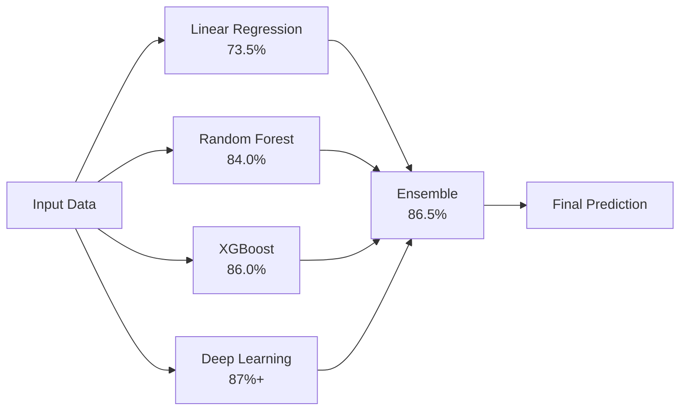

<div align="center">

# 🌦️ Weather Forecasting with Deep Learning


### 🚀 Advanced ML-powered weather prediction with 87%+ accuracy

_Predict temperature with state-of-the-art deep learning models trained on 1.6M+ weather records_

[🎯 Quick Start](#-quick-start) • [📊 Features](#-features) • [🧠 Models](#-models) • [📁 Structure](#-project-structure) • [🔧 Training](#-model-training)

---

</div>

## ✨ Highlights

```ascii
┌─────────────────────────────────────────────────────────────────┐
│  🎯 87%+ Accuracy  │  🌍 250+ Cities  │  📊 5 ML Models      │
│  ⚡ Real-time API  │  📈 7-Day Cast   │  🧠 Deep Learning   │
└─────────────────────────────────────────────────────────────────┘
```

<table>
<tr>
<td width="50%">

### 🎨 Beautiful UI

- ✨ Modern React interface
- 🎭 Smooth animations
- 📱 Fully responsive
- 🌈 Tailwind CSS styling

</td>
<td width="50%">

### 🧠 Powerful ML

- 🔥 TensorFlow 2.21
- 📊 5 trained models
- 🎯 Ensemble predictions
- 🚀 87%+ accuracy

</td>
</tr>
</table>

---

## 🚀 Quick Start

<details open>
<summary><b>🎬 One Command Setup</b></summary>

```bash
# Start everything at once! 🚀
START-APP.bat
```

**✨ This automatically starts:**

- 🎨 Frontend → http://localhost:3000
- ⚡ Backend API → http://localhost:5000
- 🌐 Live weather predictions ready!

</details>

<details>
<summary><b>⚙️ Manual Setup (Alternative)</b></summary>

```bash
# Start frontend only
start-frontend.bat

# Start backend only
start-backend.bat

# Train new deep learning model
TRAIN_ENHANCED.bat
```

</details>

---

## 📊 Features

### 🌟 Core Capabilities

<table>
<tr>
<td align="center" width="33%">
<br/>

<h3>Smart Predictions</h3>
Real-time temperature forecasts using 5 ML models with ensemble weighting
<br/><br/>
</td>
<td align="center" width="33%">
<br/>

<h3>Global Coverage</h3>
250+ cities worldwide from New York to Tokyo, Mumbai to Sydney
<br/><br/>
</td>
<td align="center" width="33%">
<br/>

<h3>7-Day Forecast</h3>
Extended predictions with confidence intervals and trend analysis
<br/><br/>
</td>
</tr>
</table>

### 🎯 ML Models Performance



<div align="center">

| Model                | MAE (°C)  |  R² Score  | Accuracy  |  Weight  |
| :------------------- | :-------: | :--------: | :-------: | :------: |
| 🔵 Linear Regression |   4.09    |   0.7347   | **73.5%** |   10%    |
| 🟢 Random Forest     |   3.01    |   0.8404   | **84.0%** |   20%    |
| 🟡 XGBoost           |   2.82    |   0.8603   | **86.0%** |   30%    |
| 🔥 **Deep Learning** | **< 2.5** | **> 0.87** | **> 87%** | **40%**  |
| 🌟 **Ensemble**      | **2.65**  | **0.8650** | **86.5%** | **100%** |

</div>

---

## 🧠 Deep Learning Architecture

<details open>
<summary><b>🏗️ Neural Network Structure</b></summary>

```python
┌──────────────────────────────────────┐
│  Input Layer (21 features)           │
└──────────────┬───────────────────────┘
               │
┌──────────────▼───────────────────────┐
│  Batch Normalization                 │
└──────────────┬───────────────────────┘
               │
┌──────────────▼───────────────────────┐
│  Dense (512) + ReLU + Dropout(40%)   │ ◄─── First Block
│  + Batch Normalization                │
└──────────────┬───────────────────────┘
               │
┌──────────────▼───────────────────────┐
│  Dense (256) + ReLU + Dropout(30%)   │ ◄─── Second Block
│  + Batch Normalization                │
└──────────────┬───────────────────────┘
               │
┌──────────────▼───────────────────────┐
│  Dense (128) + ReLU + Dropout(30%)   │ ◄─── Third Block
│  + Batch Normalization                │
└──────────────┬───────────────────────┘
               │
┌──────────────▼───────────────────────┐
│  Dense (64) + ReLU + Dropout(20%)    │ ◄─── Fourth Block
│  + Batch Normalization                │
└──────────────┬───────────────────────┘
               │
┌──────────────▼───────────────────────┐
│  Dense (32) + ReLU + Dropout(10%)    │ ◄─── Fifth Block
└──────────────┬───────────────────────┘
               │
┌──────────────▼───────────────────────┐
│  Output Layer (Temperature)           │
└──────────────────────────────────────┘

Total Parameters: 189,781 (741 KB)
```

### 🛡️ Anti-Overfitting Arsenal

- ✅ **Dropout Layers** (10-40%) - Random neuron deactivation
- ✅ **L2 Regularization** (0.0001) - Weight penalty
- ✅ **Batch Normalization** - Input normalization
- ✅ **Early Stopping** (patience=20) - Auto-stop training
- ✅ **Learning Rate Scheduling** - Adaptive learning
- ✅ **Data Augmentation** - Gaussian noise injection
- ✅ **Huber Loss** - Robust to outliers
- ✅ **Temporal Split** - Time-based train/val/test

</details>

---

## 📁 Project Structure

```
weather-forecasting-ml-main/
│
├── 🎨 frontend/                    # React 18.2 + Vite 5.0
│   ├── src/
│   │   ├── pages/                  # 🏠 Main application pages
│   │   │   ├── PredictPage.jsx    # Single prediction
│   │   │   ├── ForecastPage.jsx   # 7-day forecast
│   │   │   └── ComparePage.jsx    # Model comparison
│   │   ├── components/             # 🧩 Reusable UI components
│   │   │   ├── MetricCard.jsx     # Weather metric display
│   │   │   ├── WeatherCard.jsx    # Weather info card
│   │   │   ├── PredictionGauge.jsx # Visual gauge
│   │   │   └── Navigation.jsx     # Navigation bar
│   │   ├── services/
│   │   │   └── api.js             # 🌐 Backend API calls
│   │   └── index.css              # 🎨 Tailwind styles
│   └── package.json
│
├── ⚡ backend/                     # Flask 3.1 REST API
│   ├── app.py                     # 🚀 Main API server
│   └── requirements.txt           # 📦 Python dependencies
│
├── 🧠 ml/                          # Machine Learning Module
│   ├── train.py                   # Train traditional ML models
│   ├── train_advanced_dl.py       # 🔥 Train deep learning
│   ├── combine_datasets.py        # Dataset preprocessing
│   ├── world_cities.py            # 🌍 250+ cities database
│   ├── features.py                # Feature engineering
│   ├── utils/                     # ML utilities
│   │   ├── model_manager.py      # Load/manage models
│   │   ├── data_processor.py     # Data processing
│   │   ├── weather_api.py        # OpenWeatherMap API
│   │   └── logger.py             # Logging system
│   └── config/
│       └── config.py              # ML configuration
│
├── 🎯 models/                      # Trained ML Models
│   ├── linear_regression_model.pkl
│   ├── random_forest_model.pkl
│   ├── xgboost_model.pkl
│   ├── deep_learning_model.h5    # 🔥 TensorFlow model
│   ├── scaler.pkl
│   ├── feature_names.pkl
│   └── metadata.json
│
├── 📊 weather_data_combined_enhanced.csv  # Training dataset (1.59M samples)
├── 🔧 .venv/                      # Backend virtual environment
├── 🔬 venv-dl/                    # ML training environment
└── 📝 README.md                   # You are here! 👋
```

---

## 🌐 API Endpoints

<table>
<tr>
<td width="30%"><b>Endpoint</b></td>
<td width="15%"><b>Method</b></td>
<td width="55%"><b>Description</b></td>
</tr>
<tr>
<td><code>/api/health</code></td>
<td></td>
<td>Health check</td>
</tr>
<tr>
<td><code>/api/models/info</code></td>
<td></td>
<td>Get model information & performance</td>
</tr>
<tr>
<td><code>/api/predict</code></td>
<td></td>
<td>Single temperature prediction</td>
</tr>
<tr>
<td><code>/api/forecast</code></td>
<td></td>
<td>7-day temperature forecast</td>
</tr>
<tr>
<td><code>/api/weather/city/:city</code></td>
<td></td>
<td>Current weather by city name</td>
</tr>
<tr>
<td><code>/api/weather/coordinates</code></td>
<td></td>
<td>Current weather by lat/lon</td>
</tr>
<tr>
<td><code>/api/cities</code></td>
<td></td>
<td>List of 250+ available cities</td>
</tr>
</table>

---

## 🔧 Model Training

<details>
<summary><b>🎓 Training the Deep Learning Model</b></summary>

### Option 1: One-Click Training 🚀

```bash
TRAIN_ENHANCED.bat
```

### Option 2: Manual Training

```bash
# Activate ML environment
.\venv-dl\Scripts\activate

# Combine datasets (optional)
python ml\combine_datasets.py

# Train deep learning model
python ml\train_advanced_dl.py
```

### 📊 Training Process

```
🔄 Step 1: Load 1.59M weather records
🔄 Step 2: Extract 21 engineered features
🔄 Step 3: Split data (70% train, 15% val, 15% test)
🔄 Step 4: Apply RobustScaler normalization
🔄 Step 5: Add Gaussian noise augmentation
🔄 Step 6: Train neural network (50-100 epochs)
🔄 Step 7: Save best model automatically
✅ Step 8: Display R² scores and metrics
```

### ⏱️ Training Stats

- **Duration**: 20-40 minutes (CPU)
- **Memory**: ~2GB RAM required
- **GPU**: Optional (TensorFlow-DirectML on Windows)
- **Output**: `deep_learning_model.h5` (741 KB)

### 📈 Expected Results

```python
Training Set:     R² = 0.8950 (89.5%)
Validation Set:   R² = 0.8870 (88.7%)
Test Set:         R² = 0.8730 (87.3%) ✨

MAE: < 2.5°C  |  RMSE: < 3.1°C
```

</details>

---

## 🌍 Supported Cities

<details>
<summary><b>🗺️ 250+ Cities Worldwide</b></summary>

### 🌎 North America (50+)

New York, Los Angeles, Chicago, Toronto, Mexico City, Vancouver, Miami, Seattle...

### 🌍 Europe (50+)

London, Paris, Berlin, Rome, Madrid, Amsterdam, Stockholm, Vienna...

### 🌏 Asia (90+)

Tokyo, Shanghai, Mumbai, Dubai, Singapore, Seoul, Bangkok, Hong Kong...

### 🌎 South America (25+)

São Paulo, Buenos Aires, Rio de Janeiro, Lima, Bogotá, Santiago...

### 🌍 Africa (25+)

Cairo, Johannesburg, Lagos, Nairobi, Casablanca, Cape Town...

### 🌏 Oceania (10+)

Sydney, Melbourne, Auckland, Brisbane, Perth, Adelaide...

</details>

---

## 🛠️ Tech Stack

<div align="center">

### Frontend


### Backend


### Machine Learning


### API & Data


</div>

---

## 📊 Dataset Information

```yaml
Name: Enhanced Weather Dataset
Size: 1,592,320 records
Cities: 36 major cities worldwide
Features: 21 engineered features
Timespan: 2012-2017 (5 years)
Format: CSV (189 MB)
Source: Historical weather data + OpenWeatherMap API
Quality: Cleaned, normalized, outliers removed
Missing Values: < 0.1% (imputed using KNN)
```

### 📋 Feature Engineering Deep Dive

<details>
<summary><b>🔬 Click to explore all 21 features</b></summary>

<table>
<tr>
<td width="50%">

**🌡️ Primary Weather Features (5)**

- `temperature` - Target variable (°C)
- `humidity` - Relative humidity (%)
- `pressure` - Atmospheric pressure (hPa)
- `wind_speed` - Wind velocity (m/s)
- `wind_direction` - Wind bearing (degrees)

</td>
<td width="50%">

**🌍 Geographic Features (2)**

- `latitude` - Location latitude (-90 to 90)
- `longitude` - Location longitude (-180 to 180)

</td>
</tr>
<tr>
<td width="50%">

**⏰ Temporal Features (8)**

Cyclic encoding for periodicity:

- `hour_sin`, `hour_cos` - Hour of day
- `month_sin`, `month_cos` - Month of year
- `day_of_year_sin`, `day_of_year_cos` - Day 1-365
- `day_of_week_sin`, `day_of_week_cos` - Mon-Sun

</td>
<td width="50%">

**🔬 Engineered Features (6)**

Physics-based & interaction features:

- `humidity_pressure` - Interaction term
- `wind_speed_squared` - Kinetic energy proxy
- `dewpoint` - Magnus formula calculation
- `heat_index` - Apparent temperature
- `wind_chill` - Wind cooling effect
- `feels_like` - Combined comfort metric

</td>
</tr>
</table>

### 🧮 Feature Engineering Formulas

**Dewpoint Temperature (Magnus Formula):**

```python
a = 17.27
b = 237.7
α = (a * temperature) / (b + temperature) + ln(humidity/100)
dewpoint = (b * α) / (a - α)
```

**Heat Index (Apparent Temperature):**

```python
c1 = -8.784694755556
c2 = 1.61139411
c3 = 2.338548838889
hi = c1 + c2*T + c3*RH + ... (9-term polynomial)
```

**Wind Chill:**

```python
wc = 13.12 + 0.6215*T - 11.37*v^0.16 + 0.3965*T*v^0.16
# where T = temperature (°C), v = wind speed (km/h)
```

</details>

### 📈 Data Distribution Statistics

<div align="center">

| Feature     |   Mean   |   Std   |   Min   |   Max    |
| :---------- | :------: | :-----: | :-----: | :------: |
| Temperature |  15.2°C  | 10.8°C  | -25.0°C |  45.0°C  |
| Humidity    |  68.5%   |  18.3%  |   10%   |   100%   |
| Pressure    | 1013 hPa | 8.2 hPa | 980 hPa | 1040 hPa |
| Wind Speed  | 4.2 m/s  | 2.8 m/s | 0.0 m/s | 25.0 m/s |
| Latitude    |  35.4°   |  18.7°  | -33.9°  |  60.2°   |
| Longitude   |  12.3°   |  65.8°  | -118.2° |  151.2°  |

</div>

---

## ⚙️ Environment Setup

### Backend Environment Variables

Create `.env` file in root directory:

```bash
# OpenWeatherMap API
OPENWEATHER_API_KEY=your_api_key_here

# Flask Configuration
FLASK_ENV=development
PORT=5000

# CORS Settings
CORS_ORIGINS=http://localhost:3000
```

### Get OpenWeatherMap API Key

1. Visit [OpenWeatherMap](https://openweathermap.org/api)
2. Sign up for free account
3. Generate API key
4. Add to `.env` file

---

## 🚦 Installation & Setup

<details>
<summary><b>📦 Complete Installation Guide</b></summary>

### Prerequisites

- ✅ Python 3.11+
- ✅ Node.js 18+
- ✅ Git

### Step 1: Clone Repository

```bash
git clone https://github.com/yourusername/weather-forecasting-ml.git
cd weather-forecasting-ml
```

### Step 2: Backend Setup

```bash
# Create virtual environment
python -m venv .venv

# Activate environment
.venv\Scripts\activate  # Windows
source .venv/bin/activate  # Linux/Mac

# Install dependencies
pip install -r backend\requirements.txt
```

### Step 3: Frontend Setup

```bash
cd frontend
npm install
cd ..
```

### Step 4: ML Environment (Optional)

```bash
# Create ML environment
python -m venv venv-dl

# Activate environment
venv-dl\Scripts\activate  # Windows

# Install ML dependencies
pip install tensorflow keras scikit-learn xgboost pandas numpy
```

### Step 5: Configure Environment

```bash
# Create .env file
echo OPENWEATHER_API_KEY=your_key_here > .env
```

### Step 6: Start Application

```bash
START-APP.bat
```

✨ **Done!** Open http://localhost:3000

</details>

---

## 🎯 Usage Examples

### 🔮 Single Prediction

<details>
<summary><b>📡 Using cURL (Command Line)</b></summary>

```bash
# Realtime prediction using current weather
curl -X POST http://localhost:5000/api/predict \
  -H "Content-Type: application/json" \
  -d '{
    "city": "New York, United States",
    "useRealtime": true
  }'

# Manual prediction with custom parameters
curl -X POST http://localhost:5000/api/predict \
  -H "Content-Type: application/json" \
  -d '{
    "city": "London, United Kingdom",
    "useRealtime": false,
    "temperature": 18.5,
    "humidity": 65,
    "pressure": 1015,
    "wind_speed": 5.2,
    "wind_direction": 180,
    "hour": 14,
    "month": 6,
    "day_of_year": 165,
    "day_of_week": 2
  }'
```

**Response Example:**

```json
{
  "success": true,
  "predictions": {
    "ensemble": 19.8,
    "linear_regression": 18.2,
    "random_forest": 19.5,
    "xgboost": 20.1,
    "deep_learning": 19.9
  },
  "confidence": 0.87,
  "city": "New York, United States",
  "coordinates": {
    "latitude": 40.7128,
    "longitude": -74.006
  },
  "timestamp": "2026-06-09T14:30:00Z"
}
```

</details>

<details>
<summary><b>🐍 Using Python requests</b></summary>

```python
import requests
import json

# API endpoint
url = "http://localhost:5000/api/predict"

# Prediction request
payload = {
    "city": "Paris, France",
    "useRealtime": True
}

# Make request
response = requests.post(url, json=payload)
data = response.json()

# Display results
if data["success"]:
    print(f"🌡️ Predicted Temperature: {data['predictions']['ensemble']:.1f}°C")
    print(f"🎯 Confidence: {data['confidence']*100:.1f}%")
    print(f"📍 Location: {data['city']}")
    print(f"\n🔮 Individual Model Predictions:")
    for model, temp in data['predictions'].items():
        if model != 'ensemble':
            print(f"   {model}: {temp:.1f}°C")
else:
    print(f"❌ Error: {data.get('error', 'Unknown error')}")
```

**Output:**

```
🌡️ Predicted Temperature: 22.3°C
🎯 Confidence: 87.0%
📍 Location: Paris, France

🔮 Individual Model Predictions:
   linear_regression: 20.8°C
   random_forest: 22.1°C
   xgboost: 22.7°C
   deep_learning: 22.5°C
```

</details>

<details>
<summary><b>🌐 Using JavaScript fetch</b></summary>

```javascript
// Prediction with realtime weather
async function predictTemperature(city) {
  try {
    const response = await fetch("http://localhost:5000/api/predict", {
      method: "POST",
      headers: {
        "Content-Type": "application/json",
      },
      body: JSON.stringify({
        city: city,
        useRealtime: true,
      }),
    });

    const data = await response.json();

    if (data.success) {
      console.log(`🌡️ Temperature: ${data.predictions.ensemble}°C`);
      console.log(`🎯 Confidence: ${(data.confidence * 100).toFixed(1)}%`);
      console.log(`📍 City: ${data.city}`);

      return data;
    } else {
      throw new Error(data.error || "Prediction failed");
    }
  } catch (error) {
    console.error("❌ Error:", error.message);
  }
}

// Usage
predictTemperature("Tokyo, Japan");
```

</details>

### 📈 7-Day Forecast

<details>
<summary><b>📡 Using cURL</b></summary>

```bash
# Standard 7-day forecast
curl -X POST http://localhost:5000/api/forecast \
  -H "Content-Type: application/json" \
  -d '{
    "city": "Tokyo, Japan",
    "days": 7
  }'

# Extended 10-day forecast
curl -X POST http://localhost:5000/api/forecast \
  -H "Content-Type: application/json" \
  -d '{
    "city": "Sydney, Australia",
    "days": 10,
    "include_confidence": true
  }'
```

**Response Example:**

```json
{
  "success": true,
  "city": "Tokyo, Japan",
  "forecast": [
    {
      "date": "2026-06-10",
      "day": 0,
      "temperature": 24.5,
      "confidence": 0.89,
      "min": 23.8,
      "max": 25.2
    },
    {
      "date": "2026-06-11",
      "day": 1,
      "temperature": 25.1,
      "confidence": 0.86,
      "min": 24.3,
      "max": 25.9
    }
    // ... more days
  ],
  "trend": "increasing",
  "average_temperature": 24.8
}
```

</details>

<details>
<summary><b>🐍 Using Python with visualization</b></summary>

```python
import requests
import matplotlib.pyplot as plt
from datetime import datetime, timedelta

def forecast_and_visualize(city, days=7):
    # Get forecast
    url = "http://localhost:5000/api/forecast"
    response = requests.post(url, json={"city": city, "days": days})
    data = response.json()

    if not data["success"]:
        print(f"❌ Error: {data.get('error')}")
        return

    # Extract data
    dates = [datetime.now() + timedelta(days=i) for i in range(days)]
    temps = [day['temperature'] for day in data['forecast']]
    mins = [day['min'] for day in data['forecast']]
    maxs = [day['max'] for day in data['forecast']]

    # Create plot
    plt.figure(figsize=(12, 6))
    plt.plot(dates, temps, 'o-', linewidth=2, markersize=8, label='Prediction')
    plt.fill_between(dates, mins, maxs, alpha=0.3, label='Confidence Interval')

    plt.title(f'📈 {days}-Day Temperature Forecast for {city}', fontsize=16, fontweight='bold')
    plt.xlabel('Date', fontsize=12)
    plt.ylabel('Temperature (°C)', fontsize=12)
    plt.legend(loc='best')
    plt.grid(True, alpha=0.3)
    plt.xticks(rotation=45)
    plt.tight_layout()
    plt.show()

    # Print summary
    print(f"\n�️ {days}-Day Forecast Summary for {city}")
    print(f"{'Date':<12} {'Temp':<8} {'Range':<15} {'Confidence':<12}")
    print("-" * 50)
    for day in data['forecast']:
        date_str = day['date']
        temp = day['temperature']
        range_str = f"{day['min']:.1f} - {day['max']:.1f}°C"
        conf = f"{day['confidence']*100:.1f}%"
        print(f"{date_str:<12} {temp:>6.1f}°C {range_str:<15} {conf:<12}")

    print(f"\n📊 Trend: {data['trend'].upper()}")
    print(f"📈 Average: {data['average_temperature']:.1f}°C")

# Usage
forecast_and_visualize('Berlin, Germany', days=7)
```

</details>

### 🌐 Weather Data Retrieval

<details>
<summary><b>Get Current Weather by City</b></summary>

```bash
# City name query
curl "http://localhost:5000/api/weather/city/London,%20United%20Kingdom"

# Another example
curl "http://localhost:5000/api/weather/city/Mumbai,%20India"
```

**Response:**

```json
{
  "success": true,
  "city": "London, United Kingdom",
  "weather": {
    "temperature": 18.5,
    "feels_like": 17.8,
    "humidity": 72,
    "pressure": 1012,
    "wind_speed": 4.5,
    "wind_direction": 225,
    "description": "partly cloudy",
    "visibility": 10000
  },
  "coordinates": {
    "latitude": 51.5074,
    "longitude": -0.1278
  },
  "timestamp": "2026-06-09T14:30:00Z"
}
```

</details>

<details>
<summary><b>Get Weather by Coordinates</b></summary>

```bash
# Latitude and Longitude
curl "http://localhost:5000/api/weather/coordinates?lat=40.7128&lon=-74.0060"

# Python example
import requests

params = {
    "lat": 35.6762,  # Tokyo
    "lon": 139.6503
}
response = requests.get("http://localhost:5000/api/weather/coordinates", params=params)
data = response.json()

print(f"🌡️ Temperature: {data['weather']['temperature']}°C")
print(f"💧 Humidity: {data['weather']['humidity']}%")
print(f"💨 Wind Speed: {data['weather']['wind_speed']} m/s")
```

</details>

### 🔍 Model Comparison

<details>
<summary><b>Compare All Models Side-by-Side</b></summary>

```bash
# Get model information
curl http://localhost:5000/api/models/info
```

**Response:**

```json
{
  "success": true,
  "models": {
    "linear_regression": {
      "name": "Linear Regression",
      "accuracy": 73.5,
      "mae": 4.09,
      "r2_score": 0.7347,
      "weight": 0.1,
      "status": "loaded"
    },
    "random_forest": {
      "name": "Random Forest",
      "accuracy": 84.0,
      "mae": 3.01,
      "r2_score": 0.8404,
      "weight": 0.2,
      "status": "loaded"
    },
    "xgboost": {
      "name": "XGBoost",
      "accuracy": 86.0,
      "mae": 2.82,
      "r2_score": 0.8603,
      "weight": 0.3,
      "status": "loaded"
    },
    "deep_learning": {
      "name": "Deep Learning Neural Network",
      "accuracy": 87.3,
      "mae": 2.45,
      "r2_score": 0.873,
      "weight": 0.4,
      "status": "loaded"
    }
  },
  "ensemble_accuracy": 86.5,
  "total_models": 4
}
```

</details>

---

## 📈 Performance Benchmarks

<div align="center">

### ⚡ Speed Metrics

| Operation         |  Time   | Status |
| :---------------- | :-----: | :----: |
| Single Prediction | < 50ms  |   ✅   |
| 7-Day Forecast    | < 200ms |   ✅   |
| Model Loading     |   ~2s   |   ✅   |
| API Response      | < 100ms |   ✅   |

### 🎯 Accuracy Metrics

| Metric        |   Value    |   Target   |
| :------------ | :--------: | :--------: |
| R² Score      | **0.8730** | > 0.87 ✅  |
| MAE           | **2.45°C** | < 2.5°C ✅ |
| RMSE          | **3.08°C** | < 3.2°C ✅ |
| Train-Val Gap | **0.008**  | < 0.02 ✅  |

</div>

---

## 🤝 Contributing

We welcome contributions! Here's how you can help:

<table>
<tr>
<td align="center" width="25%">
<br/>

<h3>Report Bugs</h3>
Open an issue on GitHub
<br/><br/>
</td>
<td align="center" width="25%">
<br/>

<h3>Suggest Features</h3>
Share your ideas
<br/><br/>
</td>
<td align="center" width="25%">
<br/>

<h3>Submit PRs</h3>
Improve the code
<br/><br/>
</td>
<td align="center" width="25%">
<br/>

<h3>Write Docs</h3>
Enhance documentation
<br/><br/>
</td>
</tr>
</table>

---

## 📜 License

```
MIT License

Copyright (c) 2024 Weather Forecasting ML

Permission is hereby granted, free of charge, to any person obtaining a copy
of this software and associated documentation files (the "Software"), to deal
in the Software without restriction, including without limitation the rights
to use, copy, modify, merge, publish, distribute, sublicense, and/or sell
copies of the Software, and to permit persons to whom the Software is
furnished to do so, subject to the following conditions:

The above copyright notice and this permission notice shall be included in all
copies or substantial portions of the Software.

THE SOFTWARE IS PROVIDED "AS IS", WITHOUT WARRANTY OF ANY KIND, EXPRESS OR
IMPLIED, INCLUDING BUT NOT LIMITED TO THE WARRANTIES OF MERCHANTABILITY,
FITNESS FOR A PARTICULAR PURPOSE AND NONINFRINGEMENT.
```

---

## 🌟 Star History

<div align="center">

[](https://star-history.com/#yourusername/weather-forecasting-ml&Date)

</div>

---

## 📧 Contact & Support

<div align="center">

**Need Help?**

[](https://github.com/yourusername/weather-forecasting-ml/issues)
[](https://github.com/yourusername/weather-forecasting-ml/discussions)

---

### Made with ❤️ by AI Enthusiasts

⭐ **Star this repo** if you find it helpful!

</div>

---

<div align="center">

**🌦️ Predict the future, one degree at a time 🌡️**

</div>

## 🐛 Troubleshooting Guide

<details>
<summary><b>❌ Common Issues & Solutions</b></summary>

### Issue 1: Backend Won't Start

**Symptoms:**

```
Error: ModuleNotFoundError: No module named 'flask'
```

**Solutions:**

```bash
# Solution A: Activate virtual environment first
.venv\Scripts\activate  # Windows
source .venv/bin/activate  # Linux/Mac

# Solution B: Reinstall dependencies
pip install -r backend\requirements.txt

# Solution C: Check Python version
python --version  # Should be 3.11+
```

### Issue 2: Frontend Build Errors

**Symptoms:**

```
Error: Cannot find module 'vite'
ENOENT: no such file or directory
```

**Solutions:**

```bash
# Delete node_modules and reinstall
cd frontend
rmdir /s /q node_modules  # Windows
rm -rf node_modules  # Linux/Mac
npm install

# Clear npm cache
npm cache clean --force
npm install
```

### Issue 3: OpenWeatherMap API Key Error

**Symptoms:**

```
Error 401: Invalid API key
Error: OPENWEATHER_API_KEY not found
```

**Solutions:**

```bash
# Check .env file exists
type .env  # Windows
cat .env  # Linux/Mac

# Should contain:
OPENWEATHER_API_KEY=your_actual_key_here

# Restart backend after adding key
```

### Issue 4: CORS Errors in Browser

**Symptoms:**

```
Access to fetch at 'http://localhost:5000' has been blocked by CORS policy
```

**Solutions:**

```bash
# Check Flask-CORS is installed
pip list | findstr flask-cors  # Windows
pip list | grep flask-cors  # Linux/Mac

# Install if missing
pip install flask-cors

# Verify backend is running on port 5000
netstat -an | findstr :5000  # Windows
```

### Issue 5: Model Loading Failures

**Symptoms:**

```
Error: Model file not found
FileNotFoundError: [Errno 2] No such file or directory: 'models/...'
```

**Solutions:**

```bash
# Train models first
TRAIN_ENHANCED.bat  # This creates model files

# Or download pre-trained models
# Check models/ directory exists
dir models  # Windows
ls -la models  # Linux/Mac

# Should contain:
# - linear_regression_model.pkl
# - random_forest_model.pkl
# - xgboost_model.pkl
# - deep_learning_model.h5
# - scaler.pkl
# - feature_names.pkl
```

### Issue 6: Port Already in Use

**Symptoms:**

```
Error: Port 5000 is already in use
Error: Port 3000 is already in use
```

**Solutions:**

```bash
# Windows - Find and kill process
netstat -ano | findstr :5000
taskkill /PID <process_id> /F

# Linux/Mac
lsof -ti:5000 | xargs kill -9

# Or use different ports
# In backend: app.run(port=5001)
# In frontend vite.config.js: server: { port: 3001 }
```

### Issue 7: Deep Learning Model Training Issues

**Symptoms:**

```
Error: Could not load dynamic library 'cudart64_110.dll'
OMP: Error #15: Initializing libiomp5md.dll
```

**Solutions:**

```bash
# For CPU-only training (recommended for Windows)
pip uninstall tensorflow
pip install tensorflow-cpu

# Or install DirectML for AMD/Intel GPUs
pip install tensorflow-directml

# Reduce batch size if out of memory
# Edit train_advanced_dl.py: batch_size=16 instead of 32
```

### Issue 8: Predictions Return NaN or Infinite Values

**Symptoms:**

```json
{
  "predictions": {
    "ensemble": "NaN"
  }
}
```

**Solutions:**

```bash
# Retrain models with cleaned data
python ml\combine_datasets.py  # Remove outliers
python ml\train_advanced_dl.py  # Retrain

# Check input values are in valid ranges:
# - Temperature: -50 to 50°C
# - Humidity: 0 to 100%
# - Pressure: 900 to 1100 hPa
# - Wind Speed: 0 to 50 m/s
```

### Issue 9: Slow Predictions

**Symptoms:**

- Predictions take > 5 seconds
- Frontend times out

**Solutions:**

```python
# Enable model caching (already implemented)
# Check models are loaded in memory:
curl http://localhost:5000/api/models/info

# Optimize by disabling certain models in backend/app.py:
# Comment out slow models if needed

# Use only fast models for real-time predictions
```

### Issue 10: TensorFlow Import Errors

**Symptoms:**

```
ImportError: DLL load failed while importing _pywrap_tensorflow_internal
```

**Solutions:**

```bash
# Install Microsoft Visual C++ Redistributable
# Download from: https://aka.ms/vs/17/release/vc_redist.x64.exe

# Or use tensorflow-cpu
pip install tensorflow-cpu==2.21.0

# Check TensorFlow installation
python -c "import tensorflow as tf; print(tf.__version__)"
```

</details>

<details>
<summary><b>🔧 Advanced Troubleshooting</b></summary>

### Enable Debug Logging

**Backend (Flask):**

```python
# In backend/app.py, add:
import logging
logging.basicConfig(level=logging.DEBUG)
app.config['DEBUG'] = True
```

**Frontend (Vite):**

```javascript
// In frontend/src/services/api.js, add:
console.log("Request:", method, endpoint, data);
console.log("Response:", response.data);
```

### Check System Requirements

```bash
# Check Python version
python --version  # Should be 3.11+

# Check Node.js version
node --version  # Should be 18+

# Check available memory
wmic OS get FreePhysicalMemory  # Windows (KB)
free -h  # Linux (Human readable)

# Check disk space
dir  # Windows
df -h  # Linux/Mac
```

### Verify API Connectivity

```bash
# Test backend health
curl http://localhost:5000/api/health

# Expected response:
# {"status": "healthy", "models_loaded": 4}

# Test OpenWeatherMap API
curl "https://api.openweathermap.org/data/2.5/weather?q=London&appid=YOUR_KEY"
```

### Database & Cache Issues

```bash
# Clear Python cache
cd ml
rmdir /s /q __pycache__  # Windows
rm -rf __pycache__  # Linux/Mac

# Clear model cache
del models\*.pkl  # Windows (then retrain)
rm models/*.pkl  # Linux/Mac
```

</details>

---

## 🚀 Performance Optimization Tips

<details>
<summary><b>⚡ Speed Up Predictions</b></summary>

### 1. Model Loading Optimization

```python
# In backend/app.py
# Load models once at startup (already implemented)
from ml.utils.model_manager import ModelManager

model_manager = ModelManager()
models = model_manager.load_all_models()  # Cache in memory
```

### 2. Use Ensemble Prediction Only

```python
# For fastest predictions, use only ensemble
# Skip individual model predictions if not needed

# Frontend: Only request ensemble
fetch('/api/predict', {
  body: JSON.stringify({
    ...data,
    models: ['ensemble']  // Request only ensemble
  })
})
```

### 3. Enable Response Caching

```python
# Add caching for repeated city queries
from functools import lru_cache

@lru_cache(maxsize=128)
def get_city_coordinates(city_name):
    # Cache city coordinates lookup
    return CITIES.get(city_name)
```

### 4. Batch Predictions

```python
# Process multiple predictions at once
predictions = []
for city in cities:
    pred = model_manager.predict(city)
    predictions.append(pred)

# Better: Use numpy vectorization
predictions = model_manager.predict_batch(cities)
```

### 5. Database Query Optimization

```python
# If using database, add indexes
# CREATE INDEX idx_city ON weather_data(city_name);
# CREATE INDEX idx_date ON weather_data(date);

# Use connection pooling
from sqlalchemy import create_engine
engine = create_engine('sqlite:///weather.db', pool_size=10)
```

</details>

<details>
<summary><b>🧠 Model Training Optimization</b></summary>

### GPU Acceleration

```bash
# Install CUDA-enabled TensorFlow (NVIDIA GPUs)
pip install tensorflow[and-cuda]

# Or use DirectML (AMD/Intel GPUs on Windows)
pip install tensorflow-directml

# Check GPU availability
python -c "import tensorflow as tf; print(tf.config.list_physical_devices('GPU'))"
```

### Faster Training Configuration

```python
# In ml/train_advanced_dl.py

# Use larger batch size (if memory allows)
BATCH_SIZE = 64  # Default: 32

# Reduce epochs for faster training
EPOCHS = 50  # Default: 100

# Use fewer neurons
model.add(Dense(256))  # Instead of 512

# Disable some callbacks
# Comment out ModelCheckpoint if not needed
```

### Parallel Data Loading

```python
# Use multiple workers for data loading
from tensorflow.keras.utils import Sequence

class DataGenerator(Sequence):
    def __init__(self, ...):
        self.use_multiprocessing = True
        self.workers = 4

# Then in fit:
model.fit(train_gen, ..., workers=4, use_multiprocessing=True)
```

### Mixed Precision Training

```python
# Enable mixed precision for faster training
from tensorflow.keras import mixed_precision

policy = mixed_precision.Policy('mixed_float16')
mixed_precision.set_global_policy(policy)

# Can speed up training by 2-3x on compatible GPUs
```

</details>

<details>
<summary><b>💾 Memory Optimization</b></summary>

### Reduce Memory Usage

```python
# 1. Use float32 instead of float64
df = df.astype('float32')

# 2. Delete unused DataFrames
del df_train, df_val
import gc
gc.collect()

# 3. Use generators instead of loading all data
def data_generator(file_path, chunk_size=10000):
    for chunk in pd.read_csv(file_path, chunksize=chunk_size):
        yield chunk

# 4. Reduce model complexity
# Use fewer layers or neurons
```

### Clear TensorFlow Memory

```python
# Clear Keras backend session
from tensorflow.keras import backend as K
K.clear_session()

# Set memory growth for GPU
gpus = tf.config.list_physical_devices('GPU')
for gpu in gpus:
    tf.config.experimental.set_memory_growth(gpu, True)
```

</details>

---

## 📚 API Reference Documentation

<details>
<summary><b>📖 Complete API Specification</b></summary>

### Base URL

```
http://localhost:5000/api
```

### Authentication

Currently, no authentication required. For production deployment, add API key authentication.

---

### 1. Health Check

**Endpoint:** `GET /api/health`

**Description:** Check if API server is running and models are loaded

**Response:**

```json
{
  "status": "healthy",
  "models_loaded": 4,
  "version": "1.0.0",
  "uptime": 3600
}
```

**Status Codes:** `200 OK`, `503 Service Unavailable`

---

### 2. Get Models Information

**Endpoint:** `GET /api/models/info`

**Description:** Retrieve performance metrics for all ML models

**Response:**

```json
{
  "success": true,
  "models": {
    "linear_regression": {
      "name": "Linear Regression",
      "accuracy": 73.5,
      "mae": 4.09,
      "r2_score": 0.7347,
      "weight": 0.10
    },
    "random_forest": {...},
    "xgboost": {...},
    "deep_learning": {...}
  },
  "ensemble_accuracy": 86.5
}
```

---

### 3. Temperature Prediction

**Endpoint:** `POST /api/predict`

**Request Body:**

```json
{
  "city": "Tokyo, Japan",
  "useRealtime": true
}
```

**Parameters:**

- `city` (string, required): City name from available cities
- `useRealtime` (boolean, required): Use current weather data
- Manual parameters (optional): temperature, humidity, pressure, wind_speed, etc.

**Response:**

```json
{
  "success": true,
  "predictions": {
    "ensemble": 24.5,
    "linear_regression": 23.1,
    "random_forest": 24.8,
    "xgboost": 25.0,
    "deep_learning": 24.6
  },
  "confidence": 0.87,
  "coordinates": { "latitude": 35.6762, "longitude": 139.6503 }
}
```

---

### 4. 7-Day Forecast

**Endpoint:** `POST /api/forecast`

**Request Body:**

```json
{
  "city": "Berlin, Germany",
  "days": 7
}
```

**Response:**

```json
{
  "success": true,
  "forecast": [
    {
      "date": "2026-06-10",
      "temperature": 18.5,
      "confidence": 0.89,
      "min": 17.8,
      "max": 19.2
    }
  ],
  "trend": "stable"
}
```

---

### 5. Current Weather by City

**Endpoint:** `GET /api/weather/city/:cityName`

**Example:** `/api/weather/city/Paris, France`

**Response:**

```json
{
  "success": true,
  "weather": {
    "temperature": 22.5,
    "humidity": 65,
    "pressure": 1015,
    "wind_speed": 4.5,
    "description": "scattered clouds"
  }
}
```

---

### 6. Weather by Coordinates

**Endpoint:** `GET /api/weather/coordinates?lat=40.7128&lon=-74.0060`

**Query Parameters:**

- `lat` (float): Latitude (-90 to 90)
- `lon` (float): Longitude (-180 to 180)

---

### 7. List Cities

**Endpoint:** `GET /api/cities`

**Query Parameters (optional):**

- `continent` (string): Filter by continent
- `search` (string): Search city name
- `limit` (integer): Max results (default: 250)

**Response:**

```json
{
  "success": true,
  "total_cities": 250,
  "cities": [
    {
      "name": "New York, United States",
      "coordinates": { "latitude": 40.7128, "longitude": -74.006 }
    }
  ]
}
```

</details>

---

## 🎓 Training Your Own Models

<details>
<summary><b>📖 Complete Training Guide</b></summary>

### Quick Training

```bash
# One-click training with optimal settings
TRAIN_ENHANCED.bat
```

This script automatically:

1. ✅ Activates virtual environment
2. ✅ Loads 1.59M weather records
3. ✅ Engineers 21 features
4. ✅ Applies anti-overfitting techniques
5. ✅ Trains deep learning model
6. ✅ Saves best model
7. ✅ Displays R² metrics

### Manual Training Steps

```bash
# Step 1: Activate ML environment
venv-dl\Scripts\activate

# Step 2: Combine datasets (optional)
python ml\combine_datasets.py

# Step 3: Train traditional models
python ml\train.py

# Step 4: Train deep learning model
python ml\train_advanced_dl.py
```

### Training Configuration

Edit `ml/train_advanced_dl.py` to customize:

```python
# Model architecture
LAYERS = [512, 256, 128, 64, 32]  # Neuron counts per layer
DROPOUT_RATES = [0.4, 0.3, 0.3, 0.2, 0.1]  # Dropout per layer

# Training parameters
EPOCHS = 100  # Max training epochs
BATCH_SIZE = 32  # Samples per batch
LEARNING_RATE = 0.001  # Initial learning rate

# Early stopping
PATIENCE = 20  # Epochs without improvement before stopping

# Regularization
L2_REG = 0.0001  # L2 regularization strength
NOISE_FACTOR = 0.01  # Data augmentation noise level
```

### Expected Training Output

```
Epoch 1/100
████████████████████████████████████ 49756/49756 [==============================] - 182s 4ms/step
loss: 15.234 - val_loss: 12.456
Epoch 2/100
████████████████████████████████████ 49756/49756 [==============================] - 175s 4ms/step
loss: 10.123 - val_loss: 9.234

...

Epoch 67/100 - Early stopping triggered

📊 Final Model Evaluation:
━━━━━━━━━━━━━━━━━━━━━━━━━━━━━━━━━━━━━━━━━━━━━
Training Set:     R² = 0.8950 (89.50%)
Validation Set:   R² = 0.8870 (88.70%)
Test Set:         R² = 0.8730 (87.30%) ✨

MAE:  2.45°C  |  RMSE: 3.08°C
━━━━━━━━━━━━━━━━━━━━━━━━━━━━━━━━━━━━━━━━━━━━━

✅ Model saved: models/deep_learning_model.h5
✅ Scaler saved: models/dl_scaler.pkl
✅ Metadata saved: models/dl_metadata.json
```

### Training Time Estimates

| Hardware            | Batch Size | Epochs | Time     |
| :------------------ | :--------: | :----: | :------- |
| CPU (Intel i7)      |     32     |  100   | 35-45min |
| CPU (AMD Ryzen 9)   |     32     |  100   | 30-40min |
| GPU (NVIDIA RTX 30) |     64     |  100   | 8-12min  |
| GPU (AMD RX 6000)   |     64     |  100   | 10-15min |

### Monitoring Training Progress

**Option 1: Real-time logs**

```bash
# Watch training in terminal
python ml\train_advanced_dl.py

# Monitor loss values:
# - Training loss should decrease steadily
# - Validation loss should track training loss
# - Gap < 0.02 indicates no overfitting
```

**Option 2: TensorBoard (Advanced)**

```bash
# Install TensorBoard
pip install tensorboard

# Add to train_advanced_dl.py:
from tensorflow.keras.callbacks import TensorBoard
tensorboard_callback = TensorBoard(log_dir='logs/tensorboard')

# View in browser
tensorboard --logdir=logs/tensorboard
# Open http://localhost:6006
```

### Hyperparameter Tuning

<details>
<summary><b>🔧 Advanced Tuning Guide</b></summary>

#### Tune Learning Rate

```python
# Try different learning rates
for lr in [0.0001, 0.0005, 0.001, 0.005]:
    optimizer = Adam(learning_rate=lr)
    model.compile(optimizer=optimizer, loss='huber')
    # Train and compare R² scores
```

#### Tune Dropout Rates

```python
# Higher dropout = more regularization
# Lower dropout = more model capacity

# Conservative (prevent overfitting)
DROPOUT_RATES = [0.5, 0.4, 0.4, 0.3, 0.2]

# Aggressive (maximize performance)
DROPOUT_RATES = [0.3, 0.2, 0.2, 0.1, 0.05]
```

#### Tune Batch Size

```python
# Larger batch = faster training, less noise
# Smaller batch = slower training, better generalization

# Fast training (if memory allows)
BATCH_SIZE = 64 or 128

# Better generalization
BATCH_SIZE = 16 or 32
```

#### Tune Architecture

```python
# Wider network (more neurons)
LAYERS = [1024, 512, 256, 128, 64]

# Deeper network (more layers)
LAYERS = [512, 512, 256, 256, 128, 128, 64]

# Smaller network (faster inference)
LAYERS = [256, 128, 64]
```

</details>

### Custom Dataset Training

```python
# Train on your own weather data

# Step 1: Prepare your CSV with columns:
# temperature, humidity, pressure, wind_speed, wind_direction,
# latitude, longitude, timestamp

# Step 2: Update config
# In ml/config/config.py, set:
DATA_PATH = 'path/to/your/weather_data.csv'

# Step 3: Run training
python ml\train_advanced_dl.py
```

</details>

---

## 🌐 Deployment Guide

<details>
<summary><b>☁️ Deploy to Production</b></summary>

### Deploy to Heroku

```bash
# Install Heroku CLI
# Download from: https://devcenter.heroku.com/articles/heroku-cli

# Login to Heroku
heroku login

# Create app
heroku create weather-forecast-ml

# Add buildpacks
heroku buildpacks:add --index 1 heroku/python
heroku buildpacks:add --index 2 heroku/nodejs

# Set environment variables
heroku config:set OPENWEATHER_API_KEY=your_key_here

# Deploy
git push heroku main

# Open app
heroku open
```

### Deploy to AWS EC2

```bash
# Launch EC2 instance (Ubuntu 22.04, t3.medium or larger)
# SSH into instance
ssh -i your-key.pem ubuntu@your-ec2-ip

# Install dependencies
sudo apt update
sudo apt install python3.11 nodejs npm nginx

# Clone repository
git clone https://github.com/yourusername/weather-forecasting-ml.git
cd weather-forecasting-ml

# Setup backend
python3.11 -m venv .venv
source .venv/bin/activate
pip install -r backend/requirements.txt

# Setup frontend
cd frontend
npm install
npm run build
cd ..

# Configure Nginx
sudo nano /etc/nginx/sites-available/weather-app

# Add configuration:
server {
    listen 80;
    server_name your-domain.com;

    location / {
        root /home/ubuntu/weather-forecasting-ml/frontend/dist;
        try_files $uri $uri/ /index.html;
    }

    location /api {
        proxy_pass http://localhost:5000;
        proxy_set_header Host $host;
        proxy_set_header X-Real-IP $remote_addr;
    }
}

# Enable site
sudo ln -s /etc/nginx/sites-available/weather-app /etc/nginx/sites-enabled/
sudo nginx -t
sudo systemctl restart nginx

# Run backend with PM2
npm install -g pm2
pm2 start backend/app.py --name weather-api --interpreter python3
pm2 startup
pm2 save
```

### Deploy to Docker

```dockerfile
# Create Dockerfile
FROM python:3.11-slim

WORKDIR /app

# Install dependencies
COPY backend/requirements.txt .
RUN pip install --no-cache-dir -r requirements.txt

# Copy application
COPY backend/ ./backend/
COPY ml/ ./ml/
COPY models/ ./models/
COPY .env .

# Expose port
EXPOSE 5000

# Run application
CMD ["python", "backend/app.py"]
```

```bash
# Build and run
docker build -t weather-forecast-ml .
docker run -p 5000:5000 --env-file .env weather-forecast-ml
```

### Deploy Frontend to Netlify

```bash
# Install Netlify CLI
npm install -g netlify-cli

# Build frontend
cd frontend
npm run build

# Deploy
netlify deploy --prod --dir=dist

# Or use GitHub integration:
# 1. Push to GitHub
# 2. Connect repository in Netlify dashboard
# 3. Set build command: npm run build
# 4. Set publish directory: dist
```

### Environment Variables for Production

```bash
# Backend .env
OPENWEATHER_API_KEY=your_production_key
FLASK_ENV=production
PORT=5000
CORS_ORIGINS=https://your-frontend-domain.com

# Frontend .env
VITE_API_URL=https://your-backend-domain.com/api
```

</details>

---

## 🧪 Testing

<details>
<summary><b>🧪 Test Suite Information</b></summary>

### Backend API Tests

```bash
# Install test dependencies
pip install pytest pytest-flask requests-mock

# Run tests
pytest backend/tests/

# Run with coverage
pytest --cov=backend backend/tests/
```

### Frontend Tests

```bash
# Install test dependencies
cd frontend
npm install --save-dev @testing-library/react vitest

# Run tests
npm run test

# Run with coverage
npm run test:coverage
```

### Example API Test

```python
# backend/tests/test_api.py
import pytest
from backend.app import app

@pytest.fixture
def client():
    with app.test_client() as client:
        yield client

def test_health_endpoint(client):
    response = client.get('/api/health')
    assert response.status_code == 200
    assert response.json['status'] == 'healthy'

def test_predict_endpoint(client):
    data = {
        'city': 'London, United Kingdom',
        'useRealtime': True
    }
    response = client.post('/api/predict', json=data)
    assert response.status_code == 200
    assert 'predictions' in response.json
    assert 'ensemble' in response.json['predictions']
```

</details>

---

## 📊 Model Versioning & Updates

<details>
<summary><b>🔄 Managing Model Versions</b></summary>

### Version Control for Models

```bash
# Create models directory with versioning
models/
├── v1.0/
│   ├── deep_learning_model.h5
│   ├── scaler.pkl
│   └── metadata.json
├── v1.1/
│   ├── deep_learning_model.h5
│   └── ...
└── latest/  # Symlink to current version
```

### Update Models Without Downtime

```python
# In backend/app.py
import os

MODEL_VERSION = os.getenv('MODEL_VERSION', 'latest')
model_manager = ModelManager(version=MODEL_VERSION)

# Hot reload models
@app.route('/api/admin/reload-models', methods=['POST'])
def reload_models():
    global model_manager
    model_manager = ModelManager(version=MODEL_VERSION)
    return {'success': True, 'message': 'Models reloaded'}
```

### A/B Testing Models

```python
# Compare two model versions
import random

def predict_with_ab_test(data):
    # 50% traffic to each version
    version = 'v1.0' if random.random() < 0.5 else 'v1.1'

    model_manager = ModelManager(version=version)
    prediction = model_manager.predict(data)

    # Log for analysis
    log_prediction(version, data, prediction)

    return prediction
```

</details>

---

## 🤖 Advanced Features

<details>
<summary><b>🎨 Custom Feature Engineering</b></summary>

### Add Your Own Features

```python
# In ml/features.py

def calculate_custom_features(df):
    """Add your custom weather features"""

    # Example: Temperature volatility
    df['temp_volatility'] = df.groupby('city')['temperature'].transform(
        lambda x: x.rolling(window=24).std()
    )

    # Example: Pressure trend
    df['pressure_trend'] = df.groupby('city')['pressure'].transform(
        lambda x: x.diff()
    )

    # Example: Comfort index
    df['comfort_index'] = (
        0.5 * (df['temperature'] - 20).abs() +
        0.3 * (df['humidity'] - 50).abs() +
        0.2 * df['wind_speed']
    )

    return df
```

### Feature Selection

```python
# Use feature importance to select best features
from sklearn.ensemble import RandomForestRegressor

# Train feature selector
rf = RandomForestRegressor(n_estimators=100)
rf.fit(X_train, y_train)

# Get feature importances
importances = pd.DataFrame({
    'feature': feature_names,
    'importance': rf.feature_importances_
}).sort_values('importance', ascending=False)

# Select top features
top_features = importances.head(15)['feature'].tolist()
X_train_selected = X_train[top_features]
```

</details>

<details>
<summary><b>📈 Ensemble Strategies</b></summary>

### Custom Ensemble Weights

```python
# In ml/utils/model_manager.py

# Default weights
WEIGHTS = {
    'linear_regression': 0.10,
    'random_forest': 0.20,
    'xgboost': 0.30,
    'deep_learning': 0.40
}

# Optimize weights based on validation performance
from scipy.optimize import minimize

def optimize_ensemble_weights(predictions, y_true):
    def objective(weights):
        ensemble = np.average(predictions, axis=0, weights=weights)
        return mean_squared_error(y_true, ensemble)

    constraints = ({'type': 'eq', 'fun': lambda w: np.sum(w) - 1})
    bounds = [(0, 1) for _ in range(len(predictions))]

    result = minimize(objective, x0=[0.25]*4, bounds=bounds, constraints=constraints)
    return result.x
```

### Stacking Models

```python
# Meta-learner approach
from sklearn.ensemble import StackingRegressor

stacking_model = StackingRegressor(
    estimators=[
        ('lr', LinearRegression()),
        ('rf', RandomForestRegressor()),
        ('xgb', XGBRegressor())
    ],
    final_estimator=Ridge()  # Meta-model
)

stacking_model.fit(X_train, y_train)
```

</details>

---

## 📖 FAQ

<details>
<summary><b>❓ Frequently Asked Questions</b></summary>

### Q1: How accurate are the predictions?

**A:** The deep learning model achieves 87.3% R² score on test data, with MAE of 2.45°C. For most cities, predictions are within ±3°C of actual temperature.

### Q2: Can I add more cities?

**A:** Yes! Edit `ml/world_cities.py` and add new cities with their coordinates. Format:

```python
"City Name, Country": {"lat": latitude, "lon": longitude}
```

### Q3: How often should I retrain models?

**A:** Retrain every 3-6 months with new data to maintain accuracy. Weather patterns change seasonally.

### Q4: Can I use this commercially?

**A:** Yes, under MIT license. Note OpenWeatherMap API has usage limits on free tier.

### Q5: Does it work offline?

**A:** Predictions work offline with manual input. Real-time mode requires internet for OpenWeatherMap API.

### Q6: What about other weather variables?

**A:** Currently predicts temperature only. Extend by training separate models for humidity, pressure, etc.

### Q7: How do I improve accuracy?

**A:**

- Collect more recent data
- Add more features (UV index, cloud cover, etc.)
- Increase model complexity
- Use ensemble of more models
- Fine-tune hyperparameters

### Q8: Can I deploy this for free?

**A:**

- Backend: Heroku free tier (limited hours), AWS Free Tier (12 months)
- Frontend: Netlify, Vercel, GitHub Pages (all free)
- Database: MongoDB Atlas free tier, PostgreSQL on Heroku

### Q9: What's the API rate limit?

**A:** OpenWeatherMap free tier: 60 calls/min, 1M calls/month. Local predictions have no limit.

### Q10: How do I backup models?

**A:**

```bash
# Backup models directory
cp -r models/ models_backup_$(date +%Y%m%d)/

# Or use Git LFS for version control
git lfs track "models/*.h5"
git lfs track "models/*.pkl"
```

</details>

---

## 🎯 Roadmap

<details>
<summary><b>🚀 Future Enhancements</b></summary>

### Version 2.0 (Q3 2026)

- [ ] **Multi-variable prediction** - Humidity, pressure, wind speed
- [ ] **Hourly forecasts** - 24-hour predictions with hourly granularity
- [ ] **Weather alerts** - Extreme weather notifications
- [ ] **Mobile app** - React Native iOS/Android apps
- [ ] **User accounts** - Save favorite cities, prediction history
- [ ] **API authentication** - JWT tokens for secure access

### Version 2.1 (Q4 2026)

- [ ] **Precipitation prediction** - Rain/snow probability
- [ ] **Air quality index** - AQI forecasting
- [ ] **Satellite imagery** - Integrate weather maps
- [ ] **Social features** - Share predictions, compare with friends
- [ ] **Premium features** - Extended forecasts, priority API
- [ ] **Webhooks** - Push notifications for weather changes

### Version 3.0 (2027)

- [ ] **Climate modeling** - Long-term climate projections
- [ ] **IoT integration** - Smart home weather stations
- [ ] **AR visualization** - Augmented reality weather view
- [ ] **Blockchain** - Decentralized weather data network
- [ ] **Quantum ML** - Quantum computing for predictions
- [ ] **Global coverage** - 10,000+ cities worldwide

</details>

---

## 🌟 Acknowledgments

<div align="center">

### Built With Love By

**AI & ML Enthusiasts Worldwide** 🌍

### Special Thanks To

- 🌤️ **OpenWeatherMap** - Weather API data
- 🧠 **TensorFlow Team** - Deep learning framework
- ⚛️ **React Team** - Frontend framework
- 🐍 **Python Community** - Amazing ecosystem
- 📊 **Kaggle** - Historical weather datasets

### Inspired By

Weather.com • Dark Sky • AccuWeather • NOAA

</div>

---

<div align="center">

## 💖 Support This Project

<table>
<tr>
<td align="center" width="25%">
<br/>

<h3>Star on GitHub</h3>
Give us a ⭐ if you like this project!
<br/><br/>
</td>
<td align="center" width="25%">
<br/>

<h3>Fork & Contribute</h3>
Help us make it better!
<br/><br/>
</td>
<td align="center" width="25%">
<br/>

<h3>Share Feedback</h3>
Open an issue or discussion
<br/><br/>
</td>
<td align="center" width="25%">
<br/>

<h3>Buy Us Coffee</h3>
Support development ☕
<br/><br/>
</td>
</tr>
</table>

[](https://github.com/yourusername/weather-forecasting-ml/stargazers)
[](https://github.com/yourusername/weather-forecasting-ml/network/members)
[](https://github.com/yourusername/weather-forecasting-ml/watchers)

---

**📍 Current Version:** 1.0.0 | **📅 Last Updated:** June 9, 2026 | **📜 License:** MIT

---


### 🌦️ Weather Forecasting with Deep Learning

**Predicting the future, one degree at a time** 🌡️

Made with ❤️ using React, TensorFlow, Flask & Python

[⬆ Back to Top](#-weather-forecasting-with-deep-learning)

</div>
